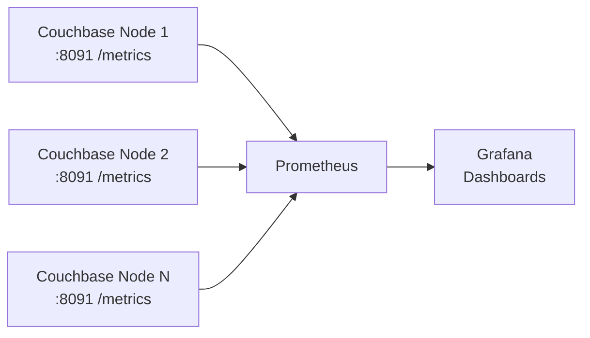

# Couchbase Monitoring with Prometheus & Grafana

## Installation & Configuration Guide — Avis IT Department

Sep 22, 2026

## Overview

Couchbase Server 7.0+ ships a native Prometheus metrics endpoint on every node — no separate exporter process to install or maintain. This guide covers wiring that endpoint up to a standalone Prometheus + Grafana monitoring stack against Avis's **existing, already-running** Couchbase cluster.



Each node exposes only its own local stats, so Prometheus scrapes every node individually (or uses Couchbase's built-in discovery API — see Step 3).

What this gives Avis IT once it's live:

- Real-time KV throughput (reads vs. writes) per bucket
- Customer-facing latency (p50/p95/p99) for GET/SET operations — an early warning signal before app-level SLAs are breached
- Capacity and backpressure trending (memory, disk queue) ahead of node additions or resizing
- A business-relevant Grafana dashboard built on top of the raw cluster metrics, not just infrastructure internals

## Prerequisites

| Requirement | Detail |
| --- | --- |
| Couchbase Server | 7.0 or later (native `/metrics` endpoint on port 8091, or 18091 over TLS) |
| Cluster access | An existing Full Admin account, used once to create a dedicated monitoring user |
| Monitoring host | A Linux VM/host (can be shared) to run Prometheus + Grafana — not on a Couchbase node itself |
| Network | Monitoring host can reach every Couchbase node on 8091/18091; end users can reach Grafana on 3000 |
| Software | Prometheus 2.40+ (3.x works, see Step 3 note), Grafana 9.0+ |
| Disk | Prometheus TSDB storage sized for retention — see Security & Hardening for sizing guidance |

None of the steps below require downtime or configuration changes on the Couchbase cluster itself beyond creating one read-only monitoring user.

## Step 1 — Create a Dedicated Prometheus User

Don't point Prometheus at the Administrator account. Couchbase ships a purpose-built, read-only **External Stats Reader** role (`external_stats_reader`) that can call only `/metrics` and the discovery API — nothing else.

**Via `couchbase-cli`** (run once, from any node or a machine with the CLI):

```bash
couchbase-cli user-manage -c localhost:8091 \
  -u Administrator -p <admin-password> \
  --set --auth-domain local \
  --rbac-username prometheus \
  --rbac-password '<choose-a-strong-password>' \
  --rbac-name "Prometheus Scraper" \
  --roles external_stats_reader
```

**Via the UI**: Couchbase Web Console → **Security** → **Add User** → set username/password → under Roles select **External Stats Reader** → Save.

### TLS (recommended for production)

Couchbase's discovery API (Step 3) requires HTTPS on port 18091. Export the cluster's CA certificate from the Web Console (**Security → Root Certificate → Download**) and save it on the monitoring host, e.g. `/etc/prometheus/cb-cert.pem` — it's referenced in the scrape config in Step 3.

## Step 2 — Install Prometheus

Run on the monitoring host (not a Couchbase node).

**Binary install (works on any distro):**

```bash
useradd --no-create-home --shell /usr/sbin/nologin prometheus
mkdir -p /etc/prometheus /var/lib/prometheus

curl -LO https://github.com/prometheus/prometheus/releases/latest/download/prometheus-linux-amd64.tar.gz
tar xzf prometheus-linux-amd64.tar.gz
cp prometheus-*/prometheus prometheus-*/promtool /usr/local/bin/
chown -R prometheus:prometheus /etc/prometheus /var/lib/prometheus
```

**systemd unit** (`/etc/systemd/system/prometheus.service`):

```ini
[Unit]
Description=Prometheus
After=network.target

[Service]
User=prometheus
ExecStart=/usr/local/bin/prometheus \
  --config.file=/etc/prometheus/prometheus.yml \
  --storage.tsdb.path=/var/lib/prometheus \
  --storage.tsdb.retention.time=30d
Restart=on-failure

[Install]
WantedBy=multi-user.target
```

```bash
systemctl daemon-reload
systemctl enable --now prometheus
```

Package-manager installs (`apt install prometheus` / a Prometheus Helm chart for Kubernetes) work equally well if that fits Avis's existing patching process — the config file in Step 3 is what matters, not the install method.

## Step 3 — Configure `/etc/prometheus/prometheus.yml`

### Option A: static list (fine for a small, fixed cluster)

```yaml
global:
  scrape_interval: 15s

scrape_configs:
  - job_name: "couchbase"
    metrics_path: /metrics
    scheme: http
    fallback_scrape_protocol: PrometheusText0.0.4
    basic_auth:
      username: prometheus
      password: "<the-password-from-step-1>"
    static_configs:
      - targets:
          - "cb-node1.avis.internal:8091"
          - "cb-node2.avis.internal:8091"
          - "cb-node3.avis.internal:8091"
```

### Option B: service discovery (recommended — auto-adds/removes nodes as the cluster scales)

```yaml
scrape_configs:
  - job_name: "couchbase"
    scheme: https
    basic_auth:
      username: prometheus
      password: "<the-password-from-step-1>"
    tls_config:
      ca_file: /etc/prometheus/cb-cert.pem
    http_sd_configs:
      - url: https://cb-node1.avis.internal:18091/prometheus_sd_config
        basic_auth:
          username: prometheus
          password: "<the-password-from-step-1>"
        tls_config:
          ca_file: /etc/prometheus/cb-cert.pem
```

The URL only needs to point at one node — it returns the full current member list for the cluster.

### Known gotcha — Prometheus 3.x

Prometheus 3.x enforces strict content-type negotiation; Couchbase's `/metrics` response doesn't set one, and the scrape fails with `non-compliant scrape target sending blank Content-Type`. The `fallback_scrape_protocol: PrometheusText0.0.4` line above (Option A) fixes it — add the same line to the Option B job if running Prometheus 3.x. We hit this directly while building the reference demo for this rollout.

### Validate

```bash
systemctl restart prometheus
curl -s http://localhost:9090/api/v1/targets | jq '.data.activeTargets[] | {job: .labels.job, health}'
# expect: {"job": "couchbase", "health": "up"}

curl -s 'http://localhost:9090/api/v1/query?query=kv_ops' | jq '.data.result | length'
# expect: a nonzero number of series
```

## Step 4 — Install Grafana & Connect It to Prometheus

**Install (Debian/Ubuntu):**

```bash
mkdir -p /etc/apt/keyrings
wget -q -O - https://apt.grafana.com/gpg.key | gpg --dearmor -o /etc/apt/keyrings/grafana.gpg
echo "deb [signed-by=/etc/apt/keyrings/grafana.gpg] https://apt.grafana.com stable main" | tee /etc/apt/sources.list.d/grafana.list
apt update && apt install -y grafana
systemctl enable --now grafana-server
```

**Install (RHEL/CentOS):**

```bash
cat <<EOF > /etc/yum.repos.d/grafana.repo
[grafana]
name=grafana
baseurl=https://rpm.grafana.com
repo_gpgcheck=1
enabled=1
gpgcheck=1
gpgkey=https://rpm.grafana.com/gpg.key
EOF
yum install -y grafana
systemctl enable --now grafana-server
```

Grafana listens on port **3000**. Log in at `http://<monitoring-host>:3000` with the default `admin`/`admin` and change the password immediately when prompted.

### Add the Prometheus data source

**Via UI**: Connections → Data sources → Add data source → Prometheus → URL `http://localhost:9090` (or the Prometheus host's address) → Save & test.

**Via provisioning file** (repeatable, source-controlled — recommended): `/etc/grafana/provisioning/datasources/datasource.yml`

```yaml
apiVersion: 1
datasources:
  - name: Prometheus
    type: prometheus
    access: proxy
    url: http://localhost:9090
    isDefault: true
```

Restart Grafana after adding the file: `systemctl restart grafana-server`.

## Step 5 — Import Dashboards

Two dashboards were built and validated against a live Couchbase 7.6 cluster scraping through this exact config; both import the same way.

**Import steps** (either dashboard): Grafana → Dashboards → New → Import → upload the dashboard JSON (or paste it) → select the **Prometheus** data source created in Step 4 → Import. For a permanent, source-controlled install, drop the JSON file in `/etc/grafana/provisioning/dashboards/` instead and add a provider file there (`dashboard.yml`) pointing at that path — Grafana then loads it automatically on every restart.

### 1. Cluster-wide health dashboard

Community dashboard covering node status, resource usage (CPU/memory/disk) per node, rebalance state, and per-bucket stats — built specifically for Couchbase's native `/metrics` endpoint (no exporter required), the same source: [celticht32/Grafana-Dashboard-Couchbase-Metrics](https://github.com/celticht32/Grafana-Dashboard-Couchbase-Metrics). 68 panels across 10 functional areas (KV, Query, Index, Search, XDCR, etc.). Good default for the ops/DBA team's day-to-day view.

### 2. Business operations dashboard (template to adapt)

A second, curated dashboard was purpose-built for a rental-operations workload during this rollout's proof-of-concept — fewer panels, framed around what a business stakeholder cares about rather than raw internals. Avis IT should clone this pattern and point it at production bucket name(s) instead of the demo bucket. Core panel queries (swap `"<bucket>"` for the real bucket):

| Panel | PromQL |
| --- | --- |
| Read throughput (ops/sec) | `sum(rate(kv_ops{bucket="<bucket>", op="get"}[1m]))` |
| Write throughput (ops/sec) | `sum(rate(kv_ops{bucket="<bucket>", op="set"}[1m]))` |
| GET latency p95 (ms) | `histogram_quantile(0.95, sum(rate(kv_cmd_duration_seconds_bucket{opcode="GET"}[1m])) by (le)) * 1000` |
| SET latency p95 (ms) | `histogram_quantile(0.95, sum(rate(kv_cmd_duration_seconds_bucket{opcode="SET"}[1m])) by (le)) * 1000` |
| Item count | `kv_curr_items{bucket="<bucket>"}` |
| Memory used | `kv_mem_used_bytes{bucket="<bucket>"}` |
| Cache resident ratio | `kv_vb_perc_mem_resident_ratio{bucket="<bucket>", state="active"}` |
| Disk queue fill vs. drain | `rate(kv_ep_diskqueue_fill{bucket="<bucket>"}[1m])` vs. `rate(kv_ep_diskqueue_drain{bucket="<bucket>"}[1m])` |

### Validate

Open each dashboard and confirm panels render live-moving data (not "No data"). If a panel is blank, check: the bucket name in the query matches a real bucket (`bucket_list` in the Couchbase UI), and the Prometheus data source selected on import matches the one from Step 4.

## Security & Production Hardening

- [ ] Prometheus scrapes using the `external_stats_reader` user only — never Administrator credentials, in this file or any other
- [ ] TLS enabled for scraping (port 18091 + CA cert) rather than plaintext 8091, especially if the monitoring host isn't on the same trusted network segment as the cluster
- [ ] Grafana's default `admin`/`admin` password changed on first login; SSO/LDAP wired in if Avis has an existing identity provider
- [ ] Prometheus (9090) and Grafana (3000) not exposed to the public internet — firewall to the internal network / VPN only
- [ ] Prometheus TSDB retention and disk sized for how long Avis needs history (30 days at 15s scrape interval is a reasonable default; each additional bucket/node adds meaningfully to series count)
- [ ] Alerting configured via Alertmanager (or Grafana-native alerting) on top of this Prometheus instance for latency/error thresholds — this guide covers visualization only, not paging
- [ ] Cardinality watched on large clusters: per-vBucket and per-collection metrics multiply quickly across many buckets/nodes; consider `metric_relabel_configs` to drop unneeded label dimensions if Prometheus memory usage grows
- [ ] Couchbase Server upgrades checked against Prometheus/Grafana versions in use; metric names have been stable since 7.0 but new metrics are added in later releases

## Appendix: Metric Reference

| Metric | Labels | What it means |
| --- | --- | --- |
| `kv_ops` | `bucket`, `op` | Cumulative op count by type (get, set, delete, …) — use `rate()` for ops/sec |
| `kv_cmd_duration_seconds_bucket` | `opcode` | Latency histogram; use `histogram_quantile()` for p50/p95/p99 |
| `kv_curr_items` | `bucket` | Live document count in a bucket |
| `kv_mem_used_bytes` | `bucket` | RAM currently used by a bucket |
| `kv_vb_perc_mem_resident_ratio` | `bucket`, `state` | % of a bucket's data resident in memory (cache effectiveness) |
| `kv_ep_diskqueue_fill` / `kv_ep_diskqueue_drain` | `bucket` | Writes queued for disk vs. persisted — backpressure indicator |
| `up` | `job` | 1 if the scrape target is reachable, 0 if not |
| `cm_rebalance_in_progress` | — | 1 while the cluster is rebalancing |
| `sys_cpu_host_utilization_rate` | — | Host CPU utilization, already a 0–100 percentage |

### Sources

- [Configure Prometheus to Collect Couchbase Metrics](https://docs.couchbase.com/server/current/manage/monitor/set-up-prometheus-for-monitoring.html)
- [Couchbase Server Roles — External Stats Reader](https://docs.couchbase.com/server/current/learn/security/roles.html)
- [Prometheus Discovery API](https://docs.couchbase.com/server/current/rest-api/rest-discovery-api.html)
- [Grafana-Dashboard-Couchbase-Metrics](https://github.com/celticht32/Grafana-Dashboard-Couchbase-Metrics)
- [Monitoring a NoSQL Database with Couchbase and Prometheus](https://www.couchbase.com/blog/monitoring-a-nosql-database-with-couchbase-and-prometheus/)
